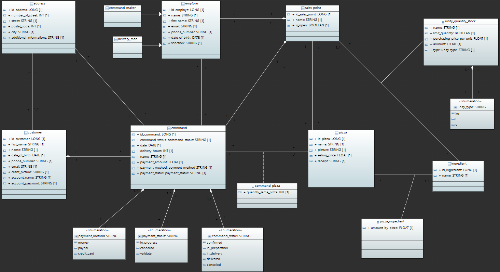
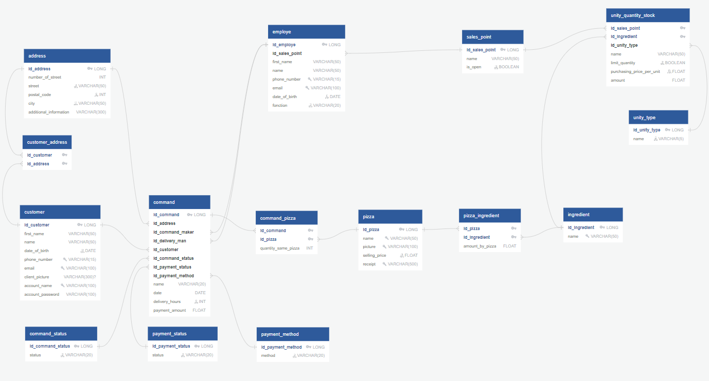

# OC-Pizza
# Design the technical solution for a pizzeria management system for the company OC Pizza

“OC Pizza” is a young, booming group of pizzerias specializing in delivered or takeaway pizzas. It already has 5 points of sale, and plans to open at least 3 more by the end of the year. The company needs a solution allowing a group of pizzerias to manage their pizzerias and provide online ordering solutions. It needs an IT system deployed in all its pizzerias, allowing it to be more efficient in managing orders, from their receipt to their delivery, including their preparation, via the following functionalities:

For employees: 
- real-time monitoring of orders placed and in preparation;
- real-time monitoring of the stock of remaining ingredients, to know which pizzas can still be made;
- a cheat sheet for pizza makers, indicating the recipe for each pizza.

For the customers :
A website that will allow them: 
- to place their order – in addition to taking orders by telephone or on site,
- to pay for their order online if they wish – otherwise, they will pay directly on delivery,
- to modify or cancel their order, as long as it has not been prepared;
- to receive notifications when the order is ready to be delivered or received.

## Sommaire
- [Project objectives](#project-objectives)
- [Technical specifications](#technical-specifications)
  - [Description of the functional domain](#description-of-the-functional-domain)
  - [Physical data model](#physical-data-model)
- [MySQL database](#mysql-database)
- [Documentation](#documentation)

## Project Objectives

Design the technical architecture of the solution to meet the client's needs:

- Model the objects of the functional domain;
- Initialize the structure of the functional domain in a database management system;
- Develop the schema for the database(s) I intend to create.

Transposition of the functional domain modeling into a database, producing a physical data model and SQL scripts to create the database and provide a test dataset to validate its functionality. Preparation of a presentation with the following elements:

- Proposal of a project management methodology adapted to the context, with arguments comparing it to other existing project methodologies (comparative table);
- Identification of the different project stakeholders with a RACI matrix;
- High-level project planning.

## Technical specifications

### Description of the functional domain

The analysis of the functional domain involves the development of the class diagram for the technical architecture of our project. The goal of the project is to model an IT system for managing pizzerias, so the functional domain is developed around three main classes:

- command: The record of the order and its information.
- customer: The person who places an order at one of the group's pizzerias.
- sales_point: The place where pizza orders are registered and prepared.

The system requires a number of other classes:
- address: Adress of the customer.
- command_status: Status of the command who permit the customer to follow his command.
- invoice: Records payment information.
- payment_method: List of all payment solutions accepted by the group's pizzerias.
- payment_status: Status of payment.
- pizza: Pizzas that can be ordered by the customer with their receipt.
- ingredient: The list of ingredients needed to make a pizza.
- quantity_stock: The inventory of ingredients available for each point of sale.
- unity: List of unity types of the ingredients.
- command_maker: Employes of the pizzerias who made the pizzas for the customer.
- delivery_man: Employes of the pizzerias who deliver the pizzas at the address of the customer.
- Daily_recipes: Daily revenues and expenses for each Sales point.

### Physical data model

The physical data model makes it possible to build the final structure of the database with the different links between the elements that compose it. Attributes are always not null if it's not specified.

## MySQL database

## Documentation

